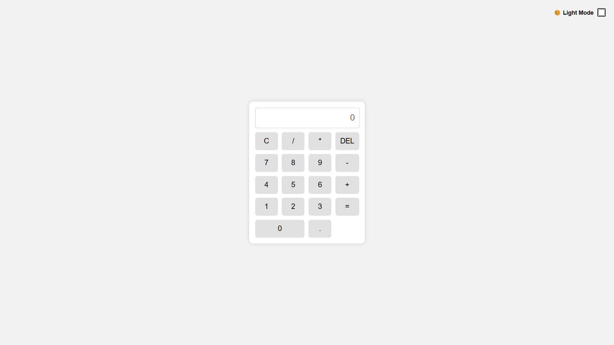

# 🔢 Kalkulator Sederhana

Ini adalah proyek front-end sederhana berupa aplikasi **kalkulator digital** yang dibangun menggunakan **HTML, CSS, dan JavaScript murni (vanilla JS)**. Aplikasi ini mendukung operasi matematika dasar seperti penjumlahan, pengurangan, perkalian, dan pembagian.

---

## ✨ Fitur

- Tampilan user-friendly dan responsif
- Operasi dasar: `+`, `-`, `*`, `/`
- Dukungan input via **mouse klik** dan **keyboard**
- **Dark Mode** otomatis & manual (toggle)
- Tampilan angka realistis (seperti kalkulator fisik)
- Efek animasi tombol saat ditekan
- Reset nilai ke `0` saat awal & saat tombol `esc` ditekan

---

## 🖥️ Teknologi yang Digunakan

- HTML5
- CSS3
- JavaScript (Vanilla)

---

## 🚀 Cara Menjalankan

1. Clone atau download repositori ini
2. Buka file `index.html` di browser (cukup klik dua kali)
3. Gunakan kalkulator langsung di halaman

---

## 📸 Tampilan

 <!-- Tambahkan gambar jika ada -->

---

## 📌 Catatan Tambahan

- Proyek ini tidak menggunakan framework atau library eksternal
- Cocok untuk pemula yang ingin belajar JavaScript DOM dan event handling
- Tidak menyimpan data (karena tidak menggunakan backend)

---

## 🧑‍💻 Kontributor

> Allfiandi Rahman

---

## 🪪 Lisensi

Proyek ini bersifat open-source dan dapat digunakan untuk tujuan pembelajaran atau pengembangan lebih lanjut.